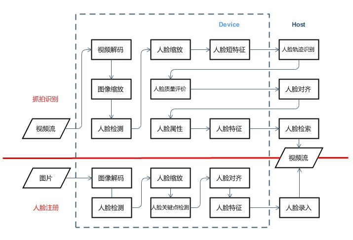

# FaceRecgnition

## 1.介绍

本开发样例演示动态人脸识别系统 FaceRecgnition，供用户参考。
本系统基于昇腾Atlas300卡，支持`HostCPU标准方案`。主要分为人脸检测识别与人脸注册两个子系统：

1. 人脸检测识别子系统负责在视频流中抓拍输出符合人脸识别要求的人脸图像，提取人脸描述特征向量并在人脸底库中进行检索。
2. 人脸注册子系统在用户提供的图像中精确定位人脸位置，将人脸对齐以提高识别精度，提取人脸描述特征向量并录入人脸库。

  **注意：**  注册生成的特征信息存放于可执行文件同目录下`face/`和`featureLib/`中，包含人脸特征等敏感数据，使用完后请按照当地法律法规要求自行处理，防止信息泄露。

HostCPU标准方案，部署相对简单，开发难度低。

### 1.1支持的产品

本系统采用Atlas300-3010作为实验验证的硬件平台，并支持Atlas200RC以及Atlas500的硬件平台.具体产品实物图和硬件参数请参见《Atlas 300 AI加速卡 用户指南（型号 3010）》。由于采用的硬件平台为含有Atlas 300的Atlas 800 AI服务器 （型号3010），而服务器一般需要通过网络访问，因此需要通过笔记本或PC等客户端访问服务器，而且展示界面一般在客户端。

### 1.2支持的版本

支持1.75.T11.0.B116, 1.75.T15.0.B150, 20.1.0

版本号查询方法，在Atlas产品环境下，运行以下命令：
```bash
npu-smi info
```

### 1.3软件方案介绍

软件方案将人脸识别子系统划分为抓拍识别,人脸注册和结果展示三个子系统。子系统功能具体描述请参考 表1.1 系统方案各子系统功能描述。抓拍识别和人脸注册的算法流程非常相似，而且实际应用中为了保证人脸识别的效果，人脸注册的人脸检测、人脸对齐、人脸特征提取模块复用了抓拍识别的模块，算法模型保持一致。本方案选择YOLOV3-tiny作为人脸检测模型、人脸特征点检测和人脸描述向量提取模型都选择resnet18作为主框架。系统方案中各模块功能如表1.2 所示。

表1.1 系统方案各子系统功能描述：

| 序号 | 子系统   |                           功能描述                           |
| ---- | -------- | :----------------------------------------------------------: |
| 1    | 抓拍识别 | 从视频流图片中抓拍人脸：检测人脸、去重、质量评价、挑选最佳人脸，送入人脸结构化模块：经过人脸对齐、人脸特征提取和属性识别，经过人脸检索，送入最终的结果展示模块。 |
| 2    | 人脸注册 | 注册建库流程主要负责将人脸图像底库的数据集导入，在人脸图像数据集的每张上检测最大人脸、将人脸对齐、并提取人脸特征描述向量，最后将人脸特征描述向量和人脸图像输入人脸检索系统建库。 |
| 3    | 结果展示 | 在抓拍图像上叠加人脸检测框、叠加人脸信息、展示当前抓拍的人脸信息和比中的人脸图像、人脸属性信息、多路视频合一显示。 |

表1.2 系统方案中个模块功能：

| 序号 | 子系统           | 功能描述                                                     |
| ---- | ---------------- | ------------------------------------------------------------ |
| 1    | 注册图像         | 指人脸底库或黑白名单人脸图像数据集（JPG或PNG格式             |
| 2    | 视频流或抓拍图像 | 前端人脸抓拍设备返回的人脸抓拍图像（JPG格式）或普通相机输出的视频流（H.264或H.265），一般从HOST端的网络设备输入。本系统中主要对接抓拍图像，可以兼顾人脸视频的简单展示模式。 |
| 3    | 视频图像解码     | 为了降低传输带宽，一般需要将视频或图像进行编码压缩后通过网络传输，后面的处理需要针对RGB格式数据，所以都存在需要解码的需求，为了系统整体性能，一般通过硬件（DVPP）进行解码。 |
| 4    | 图像预处理       | 视频解码得到原图，需要对原图进行缩放，然后输入到人脸检测模块和视频拼帧模块。 |
| 5    | 视频拼帧         | 多路视频同时显示，需要将每一路缩放的图像拼成一路视频显示。   |
| 6    | 视频编码         | 拼帧完成后，使用硬件（DVPP）进行编码，并将码流传送到web显示。 |
| 7    | 人脸图像预处理   | 在进行基于深度神经网络的图像处理之前，一般需要将图像缩放到固定的尺寸和格式，往往还会涉及到图像的抠图，如根据人脸检测模型获得的人脸坐标和置信度信息，从原始实时视频帧中获取人脸的ROI小图，用于后面的对齐和特征提取。 |
| 8    | 人脸检测         | 基于深度学习的人脸检测是基于深度学习的目标检测算法的一种应用特例，也是系统的核心模块，业界对于目标检测算法有深入的研究并取得实用性的效果，目前常用的目标检测深度神经网络模型有SSD、YOLOV3、FasterRCNN等。 |
| 9    | 人脸关键点检测   | 人脸关键点检测也称为人脸关键点定位，是指给定人脸图像，定位出人脸面部的关键区域位置，包括眉毛、眼睛、鼻子、嘴巴、脸部轮廓等，是人脸识别任务中重要的基础环节。 |
| 10   | 人脸对齐         | 根据上面获得的ROI人脸图像，针对图像和人脸模板将ROI中的人脸通过旋转获得人脸的正面对齐图像,同时需要根据特征提取模块的输入大小Resize ROI图像。 |
| 11   | 人脸特征提取     | 在对齐的ROI人脸图像上运用CNN神经网络提取人脸的特征值，并对特征值进行L2归一化。 |
| 12   | 人脸特征对比     | 通过深度学习神经网络获得的人脸特征向量和注册的人脸特征库中的特征向量做比对，比对的方法一般采用欧式距离或余弦距离计算，根据实际网络推理效果设定特定阈值。 |
| 13   | 人脸特征库       | 根据采集到的人脸图片，使用上面的人脸检测、对齐、特征提取等流程将注册的人脸提取出人脸特征，将特征和图像的UUID进行映射，可以通过特征向量索引到对应的人脸信息。 |
| 14   | 人脸信息库       | 根据实时抓拍图像或人脸注册底库获得的检测人脸信息可以保存在人脸信息数据库中，作为识别结果展示使用，或其他高级业务使用。 |
| 15   | 结果展示         | 实时显示监控到的人物的信息，如姓名、性别等等。               |

### 1.4硬件方案简介

考虑到人脸识别子系统主要在中心端应用，因此本系统采用Atlas300-3010作为实验验证的硬件平台。Atlas300-3010由独立的4片含有AICore的Hi1910V100芯片组成。由于采用的硬件平台为含有Atlas300-3010的服务器，而服务器一般需要通过网络访问，因此需要通过笔记本或PC等客户端访问服务器，而且展示界面一般在客户端。本系统测试验证所使用的服务器型号为Atlas800-3010型号。 

### 1.5方案架构设计

HostCPU标准方案适合Atlas 300的标准部署形态，程序运行在Host端，实现视频拉流、视频解码、图像缩放、人脸检测、关键点定位、人脸矫正。人脸特征等步骤，过程中利用了ACL内存拷贝接口，实现Host到Deive或者Device到Host的数据搬移。在人脸注册流程中，将提取到的人脸特征入库。在人脸搜索流程中，从视频中抓取人脸，并对其进行人脸识别，在底库中检索的结果进行展示和存储。


### 1.6代码主要目录介绍

本Sample工程名称为facerecognition，工程目录如下图1.2所示：

```
.
├── AscendBase
├── build.sh
├── cmake
│   ├── Ascend.cmake
│   └── FindFFMPEG.cmake
├── CMakeLists.txt
├── Common
│   ├── AscendCV
│   │   └── FaceRecognition
│   │       ├── DataType
│   │       ├── FaceFeatureLib
│   │       ├── FrameCache
│   │       ├── MemoryPool
│   │       ├── ModelResource
│   │       ├── Module
│   │       │   ├── FaceAttribute//人脸属性
│   │       │   ├── FaceDetailInfo
│   │       │   ├── FaceDetection//人脸检测
│   │       │   ├── FaceFeature//人脸特征
│   │       │   ├── FaceLandmark//人脸关键点
│   │       │   ├── FaceResize//人脸缩放
│   │       │   ├── FaceSearch//人脸搜索
│   │       │   ├── FaceStock//人脸录入
│   │       │   ├── FrameAlign
│   │       │   ├── ImageDecoder//图片解码
│   │       │   ├── ImageReader
│   │       │   ├── ModuleBase
│   │       │   ├── MOTConnection//人脸去重
│   │       │   ├── MOTEmbedding//人脸短特征
│   │       │   ├── QualityEvaluation//人脸质量评估
│   │       │   ├── RegResultHandler
│   │       │   ├── StreamPuller//视频拉流
│   │       │   ├── VideoConcat//视频拼帧
│   │       │   ├── VideoDecoder//Decvie视频解码
│   │       │   ├── VideoDecoderHost//Host视频解码
│   │       │   ├── VideoEncoder//视频编码
│   │       │   ├── VideoResize
│   │       │   └── WarpAffine//仿射变换
│   │       ├── ModuleFactory
│   │       ├── ResultCache
│   │       └── StreamCache
│   ├── CommandLine.h
│   ├── Common.h
│   ├── CostStatistic
│   ├── DataTrans
│   ├── FileEx
│   ├── Hdc
│   ├── HdcChannel
│   ├── Proto
│   ├── RegistApi
│   ├── SystemManager
│   ├── TestCV
│   └── WsServer
├── data
│   └── config
├── HostCPU//HostCPU标准方案
```

###1.7技术流程图



## 2.环境依赖

推荐系统为ubuntu 18.04或centos 7.6，环境依赖软件和版本如下表：

| 软件名称 | 版本          |
| -------- | ------------- |
| cmake    | 3.14+         |
| Python   | 3.7.5         |
| protobuf | 3.11.2        |
| g++      | 4.8.5 / 7.3.0 |
| GLIBC    | 2.23          |
| automake | 1.16          |


在编译运行Demo前，需设置环境变量：
*  `ASCEND_HOME`      Ascend安装的路径，一般为 `/usr/local/Ascend`
*  `DRIVER_HOME`      可选，driver安装路径，默认和$ASCEND_HOME一致，不一致时请设置
*  `ASCEND_VERSION`   acllib 的版本号，用于区分不同的版本，参考$ASCEND_HOME下两级目录，一般为 `ascend-toolkit/*version*`
*  `ARCH_PATTERN`     acllib 适用的 CPU 架构，查看```$ASCEND_HOME/$ASCEND_VERSION```文件夹，可取值为 `x86_64-linux` 或 `arm64-linux`等

```bash
export ASCEND_HOME=/usr/local/Ascend
export DRIVER_HOME=/usr/local/Ascend
export ASCEND_VERSION=ascend-toolkit/latest
export ARCH_PATTERN=x86_64-linux
```


## 3.编译

**步骤1**：获取动态人脸代码

**步骤2**：编译程序前提需要先交叉编译好第三方依赖库，第三方依赖库详见下面目录<软件依赖说明>。

注意：第三方依赖库请使用对应版本的GCC编译，否则会出现编译程序连接失败的问题。

**步骤3**：修改代码目录中：```src/CMakeLists.txt```下的路径为实际安装依赖包的路径。修改代码路径如下所示：

```cmake

set(HostOpenCVFolder /usr/local/opencv)				# Host侧opencv 请修改为实际路径
set(HostProtobufFolder /usr/local/protobuf)			# Host侧opencv 请修改为实际路径
set(HostUWebSocketsFolder /usr/local/uWebSockets)	# Host侧uWS 请修改为实际路径
set(HostJsonFolder /usr/local/nlohmann)				# Host侧nlohmann json 请修改为实际路径
set(FFMPEG_PATH /usr/local/ffmpeg)					# Host侧ffmpeg 请修改为实际路径
```

**步骤4**：配置需要使用的芯片和视频的路数，修改```data/config/setup.config```文件：

```bash
SystemConfig.deviceId = 0  		# 指定需要使用的芯片，芯片编号从0开始
SystemConfig.channelCount = 1  	# 指定输入的视频路数

streamWidthMax = 1920		#视频流宽，请根据rtsp流的宽高设置
streamHeightMax = 1080		#视频流高，请根据rtsp流的宽高设置

stream.chxx = rtsp://xxx.xxx.xxx.xxx:xxxx/xxx.264 	#指定每路视频流rtsp地址
```

**步骤5**：返回到代码目录下执行编译，会生成可执行文件到`src/dist/HostCPU`文件，命令如下：

```bash
bash build.sh
```

**注**：编译A500程序需要在ARM服务器上编译

## 4.运行

### 4.1 部署

**步骤1**：联系我们获取最新模型，放到```dist/HostCPU/model```文件夹内

**步骤2**：配置`LD_LIBRARY_PATH`环境变量

程序的依赖库可以通过下面指令查看，将需要依赖库路径配置到`LD_LIBRARY_PATH`环境变量中。

```bash
ldd ./AclFaceRecognitionHostCPU
```

**注**：在A500环境上执行程序，除了将`dist/HostCPU`文件夹拷贝到A500上，还需要将程序依赖的`ffmpeg`、`protobuf`、`opencv`等第三方库都需要打包发送到A500环境上。若带web显示，还需要打包`uWebSockets`依赖库。

### 4.2 运行

直接运行

```bash
./AclFaceRecognitionHostCPU -debug_level 1
```

### 4.3 运行结果

Host侧连接窗口会打印人脸的帧结果和获取到的人脸信息，格式形如下面所示。

```
Recv Ch #xx Frame #xx FaceCount xx
```

## 5.软件依赖说明

程序的软件依赖可参见`src/HostCPU`目录的`CMakeLists.txt`文件，见文件末尾“target_link_libraries”参数处。

编译方法参考```Third Party Software Install Guild```

### 5.1 软件依赖

| 依赖软件 | 版本   | 说明                                 |
| -------- | ------ | ------------------------------------ |
| opencv   | 4.2.0  | OpenCV的基本组件，用于图像的基本处理 |
| protobuf | 3.11.2 | 数据序列化反序列化组件。             |
| ffmpeg   | 4.2.1  | 视频转码解码组件                     |

## 6.常见问题
### 6.1 安装opencv失败
#### 问题描述：

编译失败：

```
undefine reference to 'gst_***'
...
collect2: error: ld returned l exit status
```

#### 解决方案：

```bash
mkdir build
cd build
cmake -DCMAKE_BUILD_TYPE=RELEASE \
-DENABLE_NEON=OFF \
-DCMAKE_INSTALL_PREFIX=/usr/local/opencv \
-DCMAKE_CXX_FLAGS="-march=armv8-a" \
-DWITH_WEBP=OFF \
-DWITH_GSTREAMER=OFF \
-DBUILD_opencv_world=ON ..
make -j8
```


### 6.2 环境执行build.sh编译动态人脸，编译失败，提示内存不足

#### 问题描述：

编译时提示：

```
virtual memory exhausted: Cannot allocate memory
```

#### 解决方案：

修改`build.sh`，把sudo make -j 改为 sudo make -j2


### 6.3 在Atlas200RC环境默认路径安装toolkit，安装失败，安装失败信息中报空间不足  

#### 问题描述：

安装toolkit时提示：

```
Not enough space left in /root ...
```

#### 解决方案：

执行安装命令时，使用`-path`改变安装的路径:

```
./Ascend-cann-toolkit_5.0.rc1_linux-aarch64.run --install-path=<your bigger space path>
```


### 6.4 数据堆塞

#### 问题描述：

大量地出现

```
[Statistic] [Module] [xxx] [xxx] [QueueSize] [xxx] [Process] [xxx ms]
```
#### 问题分析：

可能是acl日志级别较低，频繁写日志，导致接口性能下降 。

#### 解决方案：

Host侧可通过命令`export ASCEND_GLOBAL_LOG_LEVEL=3`把全局日志级别设置为error级别，Device侧可通过msnpureport工具把日志级别设为error级别，具体参考《日志参考》。

